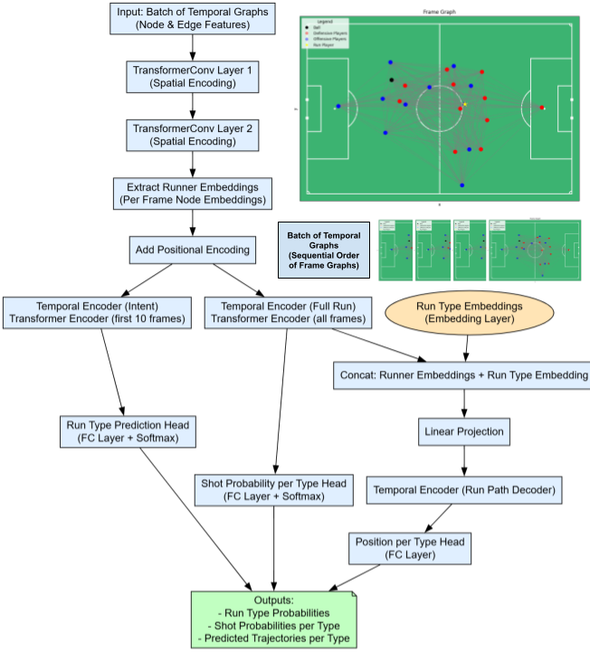

# SkillCorner X PySport Analytics Cup
This repository contains the submission template for the SkillCorner X PySport Analytics Cup **Research Track**. 
Your submission for the **Research Track** should be on the `main` branch of your own fork of this repository.

Find the Analytics Cup [**dataset**](https://github.com/SkillCorner/opendata/tree/master/data) and [**tutorials**](https://github.com/SkillCorner/opendata/tree/master/resources) on the [**SkillCorner Open Data Repository**](https://github.com/SkillCorner/opendata).

## Submitting
Make sure your `main` branch contains:
1. A single Jupyter Notebook in the root of this repository called `submission.ipynb`
    - This Juypter Notebook can not contain more than 2000 words.
    - All other code should also be contained in this repository, but should be imported into the notebook from the `src` folder.
2. An abstract of maximum 500 words that follows the **Research Track Abstract Template**.
    - The abstract can contain a maximum of 2 figures, 2 tables or 1 figure and 1 table.
3. Submit your GitHub repository on the [Analytics Cup Pretalx page](https://pretalx.pysport.org)

Finally:
- Make sure your GitHub repository does **not** contain big data files. The tracking data should be loaded directly from the [Analytics Cup Data GitHub Repository](https://github.com/SkillCorner/opendata).For more information on how to load the data directly from GitHub please see this [Jupyter Notebook](https://github.com/SkillCorner/opendata/blob/master/resources/getting-started-skc-tracking-kloppy.ipynb).
- Make sure the `submission.ipynb` notebook runs on a clean environment.

_⚠️ Not adhering to these submission rules and the [**Analytics Cup Rules**](https://pysport.org/analytics-cup/rules) may result in a point deduction or disqualification._

---

## Research Track Abstract Template (max. 500 words)
#### Introduction

Evaluating player movement and decision-making in soccer is fundamental for advanced performance analysis and tactical assessment. Off-ball runs, which represent the movements of players without possession of the ball, are critical in shaping attacking opportunities and disrupting defensive organization. This project proposes a novel modeling framework to evaluate off-ball runs by capturing both player decision-making (the choice of run type) and execution (the actual spatial trajectory taken). By leveraging spatiotemporal graph representations and graph neural networks, we develop a method to predict optimal run choices and their corresponding routes. This approach facilitates a quantitative assessment of player behavior that integrates spatial context and temporal dynamics to better understand possession outcomes and offensive effectiveness.

#### Methods

Data were sourced directly from the SkillCorner Analytics Cup GitHub repository, utilizing multiple synchronized datasets: phases of play, tracking data, and dynamic event data for each match. We reconstructed possessions from the phases of play data to determine possession outcomes, including shots and goals. By linking dynamic event data that specify off-ball runs with possession data, we associated runs with possession results, allowing us to contextualize player movements within game events.
For each off-ball run, the tracking data corresponding to the run’s timeframe were extracted, including player and ball positional and motion data. Each frame of tracking data was converted into a graph where nodes represent players and the ball, enriched with features such as position (x, y), velocity, acceleration, team affiliation, and identification of the running player. Edges capture pairwise relationships through spatial distances, velocity differences, and team membership indicators. This formulation encodes both spatial and contextual information relevant to player interactions.

The model architecture consists of stacked transformer convolution layers applied spatially on each graph frame to generate embeddings that capture spatial relationships. Subsequently, a temporal transformer processes these spatial embeddings over time to capture dynamic progression throughout the run. For run-type classification, the model uses the 10 frames prior to the run start to predict the run type selected by the player. For trajectory prediction, it incorporates these 10 pre-run frames plus all frames during the run to forecast trajectories for each possible run type, optimizing for the likelihood of resulting in a shot or goal.

The training objective is a multi-task loss combining several components: mean squared error (MSE) for trajectory positions, velocity, and acceleration to enforce realistic physical movement; a penalty for exceeding plausible maximum speeds; cross-entropy losses for run type and shot probability classification; and diversity and endpoint losses to encourage varied and plausible alternative run trajectories. The overall loss function is (view individual loss functions in appendix):

$$
\mathcal{L} = \frac{1}{N} \sum_{i=1}^N w_i \left( \mathcal{L}_{\text{pos}}^{(i)} + \lambda_{\text{vel}} \mathcal{L}_{\text{vel}}^{(i)} + \lambda_{\text{acc}} \mathcal{L}_{\text{acc}}^{(i)} + \lambda_{\text{speed}} \mathcal{L}_{\text{speed}}^{(i)} \right) + \lambda_{\text{type}} \mathcal{L}_{\text{type}} + \lambda_{\text{shot}} \mathcal{L}_{\text{shot}} + \lambda_{\text{div}} \mathcal{L}_{\text{diversity}} + \lambda_{\text{end}} \mathcal{L}_{\text{endpoint}}
$$

Where wi​ is a run-specific weight that emphasizes runs leading to shots or goals.
This allows the model to learn realistic physics based run movement that is weighted towards leading to a shot for each run type.

#### Results

The model successfully learned to classify run types and predict possession outcomes, demonstrating the ability to leverage rich spatiotemporal cues from tracking data. Quantitative evaluation using reconstruction losses on predicted trajectories showed high fidelity to actual player movements. Incorporation of diversity losses yielded a range of plausible alternative trajectories, reflecting the inherent variability in player decision-making. Table 1 presents performance metrics including classification accuracy for run types and shot probabilities, alongside trajectory reconstruction errors. Figure 2 visualizes predicted trajectories for different run types overlaid on a soccer pitch, illustrating the model’s capability to capture nuanced spatial strategies.

#### Conclusion

This study presents a comprehensive framework combining spatial-temporal graph neural networks with detailed soccer tracking data to model and evaluate off-ball player movement decisions and execution. By predicting both the type and path of runs, the approach offers coaches and analysts a powerful, data-driven tool to objectively assess player behavior and tactical effectiveness beyond traditional ball-centric metrics. Future work may extend this model to incorporate more complex contextual factors and explore applications in real-time decision support and player development.

### Appendix

#### Loss Functions

1. **Run Type Classification Loss**  
$$
\mathcal{L}_{\text{type}} = \mathrm{CrossEntropy}( \hat{\mathbf{y}}_{\text{type}}, \mathbf{y}_{\text{type}} )
$$

2. **Shot Probability Loss**  
$$
\mathcal{L}_{\text{shot}} = - \frac{1}{N} \sum_{i=1}^N \left[ y_i^{\text{shot}} \log \sigma(\hat{z}_i) + (1 - y_i^{\text{shot}}) \log (1 - \sigma(\hat{z}_i)) \right]
$$

3. **Position Loss (Trajectory MSE)**  
$$
\mathcal{L}_{\text{pos}}^{(i)} = \frac{1}{T_i} \sum_{t=1}^{T_i} \left\| \hat{\mathbf{p}}_t^{(i)} - \mathbf{p}_t^{(i)} \right\|^2
$$

4. **Velocity Loss**  
$$
\mathcal{L}_{\text{vel}}^{(i)} = \frac{1}{T_i - 1} \sum_{t=1}^{T_i - 1} \left\| \hat{\mathbf{v}}_t^{(i)} - \mathbf{v}_t^{(i)} \right\|^2
$$

where

$$
\hat{\mathbf{v}}_t^{(i)} = \frac{\hat{\mathbf{p}}_{t+1}^{(i)} - \hat{\mathbf{p}}_t^{(i)}}{\Delta t}, \quad
\mathbf{v}_t^{(i)} = \frac{\mathbf{p}_{t+1}^{(i)} - \mathbf{p}_t^{(i)}}{\Delta t}
$$

5. **Acceleration Loss**  
$$
\mathcal{L}_{\text{acc}}^{(i)} = \frac{1}{T_i - 2} \sum_{t=1}^{T_i - 2} \left\| \hat{\mathbf{a}}_t^{(i)} - \mathbf{a}_t^{(i)} \right\|^2
$$

where

$$
\hat{\mathbf{a}}_t^{(i)} = \frac{\hat{\mathbf{v}}_{t+1}^{(i)} - \hat{\mathbf{v}}_t^{(i)}}{\Delta t}, \quad
\mathbf{a}_t^{(i)} = \frac{\mathbf{v}_{t+1}^{(i)} - \mathbf{v}_t^{(i)}}{\Delta t}
$$

6. **Speed Penalty Loss**  
$$
\mathcal{L}_{\text{speed}}^{(i)} = \frac{1}{T_i - 1} \sum_{t=1}^{T_i - 1} \left( \max \left( 0, \|\hat{\mathbf{v}}_t^{(i)}\|_2 - v_{\max} \right) \right)^2
$$

7. **Trajectory Diversity Loss**  
$$
\mathcal{L}_{\text{diversity}}^{(i)} = \frac{1}{K(K-1)} \sum_{k=1}^K \sum_{\substack{l=1 \\ l \neq k}}^K \text{sim}(\hat{\mathbf{r}}_k^{(i)}, \hat{\mathbf{r}}_l^{(i)})
$$
where sim() is cosine similarity.

8. **Endpoint Diversity Loss**  
$$
\mathcal{L}_{\text{endpoint}}^{(i)} = - \frac{1}{K^2} \sum_{k=1}^K \sum_{l=1}^K \left\| \hat{\mathbf{p}}_{T_i, k}^{(i)} - \hat{\mathbf{p}}_{T_i, l}^{(i)} \right\|_2
$$

9. **Sample Weight**  
$$
w_i = w_{\text{base}} + w_{\text{shot}} \cdot y_i^{\text{shot}} + w_{\text{goal}} \cdot y_i^{\text{goal}}
$$

---

### Overall Loss

$$
\mathcal{L} = \frac{1}{N} \sum_{i=1}^N w_i \left( \mathcal{L}_{\text{pos}}^{(i)} + \lambda_{\text{vel}} \mathcal{L}_{\text{vel}}^{(i)} + \lambda_{\text{acc}} \mathcal{L}_{\text{acc}}^{(i)} + \lambda_{\text{speed}} \mathcal{L}_{\text{speed}}^{(i)} \right) + \lambda_{\text{type}} \mathcal{L}_{\text{type}} + \lambda_{\text{shot}} \mathcal{L}_{\text{shot}} + \lambda_{\text{div}} \mathcal{L}_{\text{diversity}} + \lambda_{\text{end}} \mathcal{L}_{\text{endpoint}}
$$

