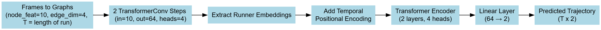
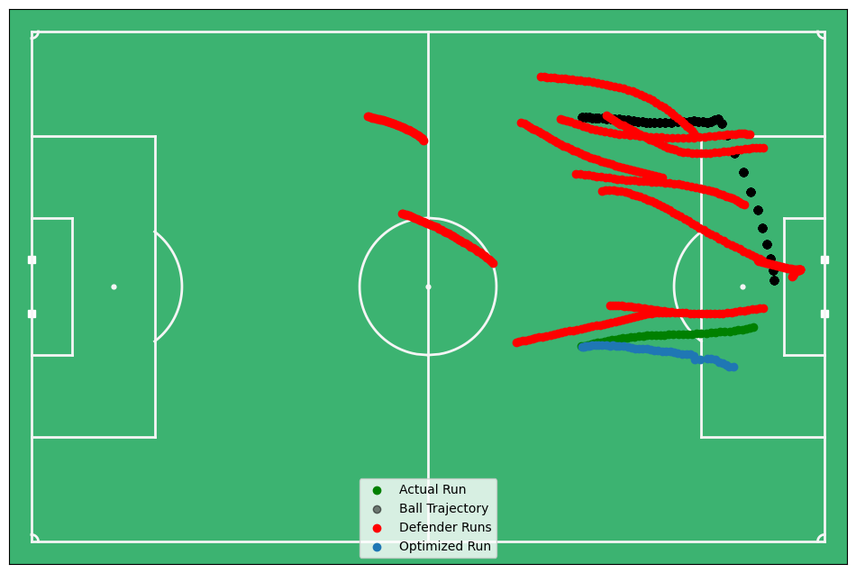
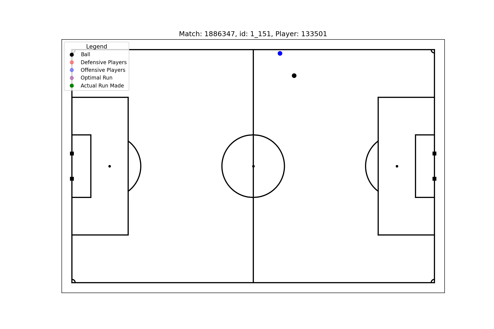

# SkillCorner X PySport Analytics Cup

## Run Route Optimization for Off Ball Runs

## Abstract

#### Introduction

Evaluating player movement in soccer is crucial for advanced performance and tactical analysis. Off ball runs, player movements without possession, play a key role in creating dangerous moments like shots and goals by opening attacking opportunities and disrupting defenses. This project presents a novel framework that models off ball runs by predicting player trajectories during these movements. Using spatiotemporal graph representations and graph neural networks, the method captures spatial context and temporal dynamics to quantitatively assess the decision making and execution of off ball runs.

#### Methods

Data were sourced from the SkillCorner Analytics Cup repository, including synchronized phases of play, tracking data, and dynamic event annotations. Off-ball runs were identified and linked to their tracking data across the run duration.
Each frame was represented as a graph with nodes for players and the ball, featuring position, velocity, acceleration, team, and runner identity. Edges captured spatial distances, velocity differences, and team relations, encoding player interactions and spatial context.

The TemporalRunnerGNN model predicts runner trajectories using two stacked TransformerConv layers for spatial encoding of each graph frame. The runner’s node embeddings were extracted per frame and assembled into temporal sequences padded to uniform length.
A Transformer encoder with learned temporal positional embeddings processed these sequences using causal masking to prevent future information leakage. The final output was a linear projection predicting 2D runner positions at each timestep.

Training minimized mean squared error between predicted and true runner positions, computed only over valid timesteps using padding masks. This encourages learning of realistic, context-aware off-ball movement.

#### Results
|   Run Lead to Shot |   Test Position Loss (MSE) |   Train Position Loss (MSE)  |   Test Velocity Loss (MSE) |   Train Velocity Loss (MSE) |   Test Acceleration Loss (MSE) |   Train Acceleration Loss (MSE) |
|--------------------------:|----------------:|-----------------:|----------------:|-----------------:|----------------:|-----------------:|
|                         0 |         2.66147 |          2.45293 |       0.0219908 |        0.0238774 |       0.0140634 |        0.0129822 |
|                         1 |         4.29505 |          3.13379 |       0.022152  |        0.0198112 |       0.0155577 |        0.0163894 |

The TemporalRunnerGNN accurately reconstructs off-ball run trajectories, capturing their direction, curvature, and temporal dynamics such as acceleration phases. Compared to baselines lacking spatial or temporal modeling, it produces smoother and more plausible trajectories.

The spatial transformer layers enable the model to incorporate player interactions and field context, while the temporal encoder captures run progression over time. Performance improves with longer sequences, demonstrating effective use of temporal context.

The spatial and temporal embeddings learned for each run sequence effectively capture the dynamics of runs in the test set, resulting in minimal prediction error (as demonstrated in the table above). This underscores the model’s ability to accurately learn and represent the complex and demanding task of run trajectory prediction.

  
  

Above you can see an output from the TemporallRunnerGNN of a optimized run route that notices the open space on the back post and puts the runner in position to collect rebounds. The actual run ended up missing the ball and the ball came out to where the optimized run would have finished. This shows the models capacity to learn dyanmics of the game.

#### Conclusion

This study presents a comprehensive framework combining spatial-temporal graph neural networks with detailed soccer tracking data to model and evaluate off-ball player movement execution. By predicting an optimized path of the run, the approach offers coaches and analysts a powerful, data-driven tool to objectively assess player behavior and tactical effectiveness beyond traditional ball-centric metrics. Future work may extend to analyzing not just the execution of the run route but also analyzing the timing of a run to find optimal moments to start an off ball run..

### Appendix

#### Loss Functions

1. **Position Loss (Trajectory MSE)**  
$$
\mathcal{L}_{\text{pos}}^{(i)} = \frac{1}{T_i} \sum_{t=1}^{T_i} \left\| \hat{\mathbf{p}}_t^{(i)} - \mathbf{p}_t^{(i)} \right\|^2
$$

2. **Velocity Loss**  
$$
\mathcal{L}_{\text{vel}}^{(i)} = \frac{1}{T_i - 1} \sum_{t=1}^{T_i - 1} \left\| \hat{\mathbf{v}}_t^{(i)} - \mathbf{v}_t^{(i)} \right\|^2
$$

where

$$
\hat{\mathbf{v}}_t^{(i)} = \frac{\hat{\mathbf{p}}_{t+1}^{(i)} - \hat{\mathbf{p}}_t^{(i)}}{\Delta t}, \quad
\mathbf{v}_t^{(i)} = \frac{\mathbf{p}_{t+1}^{(i)} - \mathbf{p}_t^{(i)}}{\Delta t}
$$

3. **Acceleration Loss**  
$$
\mathcal{L}_{\text{acc}}^{(i)} = \frac{1}{T_i - 2} \sum_{t=1}^{T_i - 2} \left\| \hat{\mathbf{a}}_t^{(i)} - \mathbf{a}_t^{(i)} \right\|^2
$$

where

$$
\hat{\mathbf{a}}_t^{(i)} = \frac{\hat{\mathbf{v}}_{t+1}^{(i)} - \hat{\mathbf{v}}_t^{(i)}}{\Delta t}, \quad
\mathbf{a}_t^{(i)} = \frac{\mathbf{v}_{t+1}^{(i)} - \mathbf{v}_t^{(i)}}{\Delta t}
$$

4. **Sample Weight**  
$$
w_i = w_{\text{base}} + w_{\text{shot}} \cdot y_i^{\text{shot}} + w_{\text{goal}} \cdot y_i^{\text{goal}}
$$

---

### Overall Loss

$$
\mathcal{L} = \frac{1}{N} \sum_{i=1}^N w_i \left( \mathcal{L}_{\text{pos}}^{(i)} + \lambda_{\text{vel}} \mathcal{L}_{\text{vel}}^{(i)} + \lambda_{\text{acc}} \mathcal{L}_{\text{acc}}^{(i)} \right)
$$

