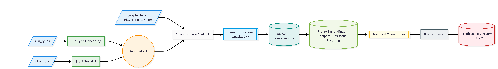
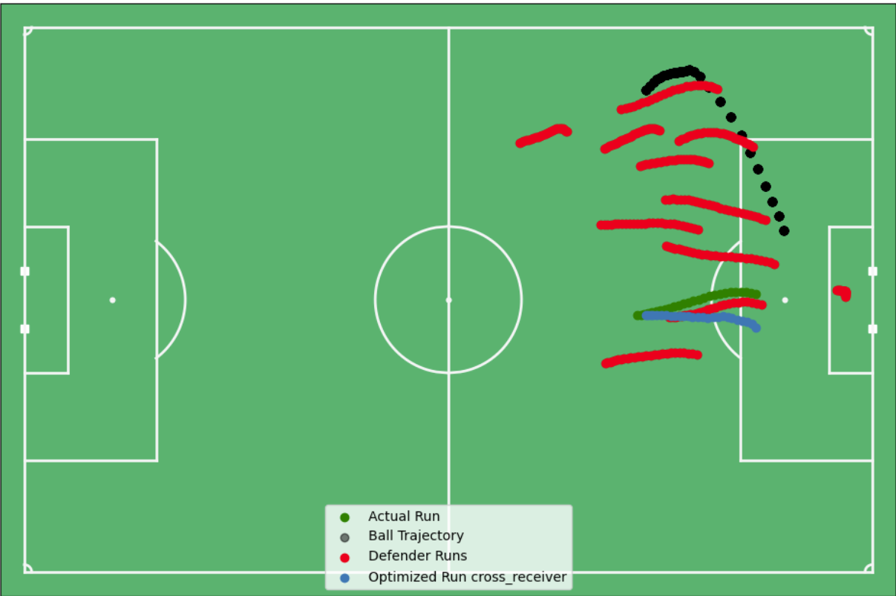
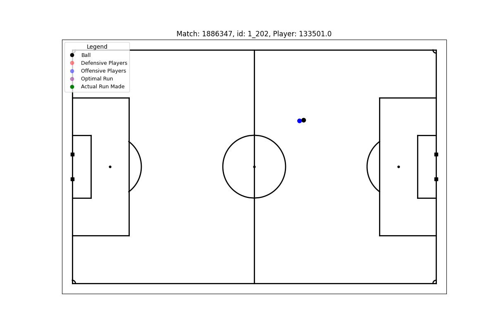
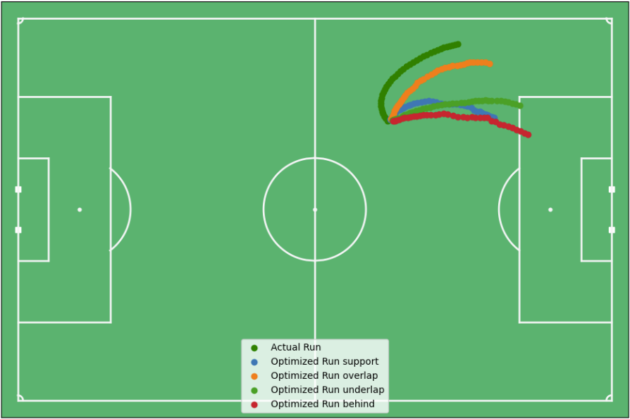

# SkillCorner X PySport Analytics Cup

## Off Ball Run Decision Making and Route Optimization

## Abstract

#### Introduction

Evaluating player movement in soccer is crucial for advanced performance and tactical analysis. Off ball runs — player movements without possession — play a key role in creating dangerous moments like shots and goals by opening attacking opportunities and disrupting defenses. This project decomposes an off-ball run into two components — **intent** (what the player was trying to do given the game state) and **execution** (the trajectory used to carry it out) — and presents a framework that explicitly models execution conditioned on intent. Using spatiotemporal graph representations and graph neural networks, the method predicts trajectories that are simultaneously realistic and dangerous, and supports counterfactual ("what-if") analysis by switching the intended run type while holding the game state fixed.

#### Methods

Data were sourced from the SkillCorner Analytics Cup repository, including synchronized phases of play, tracking data, and dynamic event annotations. Off-ball runs were identified and linked to their tracking data across the run duration.

Each frame is represented as a graph with nodes for players and the ball. Node features include position, velocity, acceleration, team identity, and runner/ball flags. Edges are fully connected (excluding self-loops) and carry relative distance, same-team indicator, ball-edge indicator, and relative speed along the edge direction. **The runner's own position, velocity, and acceleration are masked to zero** in the input graphs so that the model is forced to learn the trajectory from the surrounding game context rather than copy the ground truth.

The `TemporalRunnerGNN` model is organized into five blocks:

1. **Run Context (Intent).** The run type is mapped through a learned embedding and the run's starting field coordinates are passed through an MLP. The two are summed to form a per-run intent vector, which is broadcast and concatenated onto every node in every frame of the run.
2. **Spatial GNN (Player-Space Summary).** Two stacked `TransformerConv` layers with edge attributes encode each frame's spatial relationships into per-node embeddings.
3. **Global Attention Pooling (Frame-Space Summary).** An attention MLP scores each node and pools it into a single embedding per frame, letting the model focus on nodes that matter most to the runner's situation.
4. **Temporal Transformer (Space-Over-Time).** Frame embeddings are stacked into a sequence, summed with a learned temporal positional encoding, and passed through a Transformer encoder with causal masking and a padding mask so frames cannot attend to the future or to padding.
5. **Position Head.** A linear projection maps each frame embedding to a predicted 2D displacement (Δx, Δy) from the run's starting position, producing a `[B, T, 2]` trajectory.

Training uses a multi-task, sample-weighted loss combining position, velocity, and acceleration MSE against the true trajectory with a max-speed penalty that discourages physically implausible motion. Sample weights are scaled up for runs that lead to shots (8×) and goals (50×) so that the model is biased toward producing dangerous, high-value trajectories. Combined with masking the runner's own kinematics from the input graph, this encourages learning of realistic and *context-aware* off-ball movement rather than identity-style reconstruction.

#### Results

|   Run Lead to Shot |   Test Position Loss (MSE) |   Train Position Loss (MSE)  |   Test Velocity Loss (MSE) |   Train Velocity Loss (MSE) |   Test Acceleration Loss (MSE) |   Train Acceleration Loss (MSE) |
|--------------------------:|----------------:|-----------------:|----------------:|-----------------:|----------------:|-----------------:|
|                         0 |         2.66147 |          2.45293 |       0.0219908 |        0.0238774 |       0.0140634 |        0.0129822 |
|                         1 |         4.29505 |          3.13379 |       0.022152  |        0.0198112 |       0.0155577 |        0.0163894 |

The intent-aware `TemporalRunnerGNN` reconstructs off-ball run trajectories with realistic direction, curvature, and acceleration phases. The spatial Transformer layers capture player interactions and field context, the attention pooling focuses each frame summary on the players most relevant to the run, and the temporal Transformer captures how the play unfolds over time. Conditioning on the run-type embedding and start position lets the same scenario be analyzed under different *intents* — the model can produce a separate optimal trajectory for an overlap, an underlap, a behind run, or a support run from the same starting frame.

  
  

Above is an example output: an optimized run route that recognizes the open space at the back post and positions the runner to collect rebounds. The actual run missed the ball and the ball came out exactly to where the optimized run would have finished — illustrating the model's capacity to learn the dynamics of the game.

Because intent is an explicit input rather than something the model has to infer, the same game state can be re-queried with a different run type to produce a counterfactual trajectory. This makes the framework useful not only for evaluating the run that *happened*, but also for exploring alternative runs that *could have* happened.

#### Conclusion

This study presents a framework that combines spatial-temporal graph neural networks with explicit run-intent conditioning to model and evaluate off-ball player movement. By predicting an optimized path conditioned on intent — and by supporting counterfactual queries across run types — the approach gives coaches and analysts a data-driven tool to objectively assess decision-making and execution beyond ball-centric metrics. Natural extensions include quantifying the *viability* of each run type in a given context (how probable each intent is) and the *reception probability* of a given route, closing the loop between intent selection and execution quality.

### Next Steps

#### Quantify Intent

- **Run-type viability.** Estimate how probable each run type is given the context — e.g. a run in behind is not very probable for a runner sitting in the backline or deep midfield.
- **Reception probability.** Given the actual or predicted run route, estimate the probability of the runner receiving the ball in context, separating runs to open space for teammates from poorly configured runs.

| Run Type | Viability % | Reception % |
|----------|-------------|-------------|
| Overlap  | 30%         | 70%         |
| Underlap | 20%         | 60%         |
| Behind   | 15%         | 20%         |
| Support  | 10%         | 30%         |

#### Quantify Execution

- Estimate the probability of a shot or goal occurring from the run.
- Compare the optimized shot probability against the actual run's shot probability.
- Compare shot probability across different run-type routes for the same scenario.

| Run Type   | Lead to Shot % |
|------------|----------------|
| Overlap    | 18%            |
| Underlap   | 15%            |
| Behind     | 25%            |
| Support    | 14%            |
| Actual Run | 16%            |

#### Open Source Impact

- An objective approach to analyzing off-ball runs.
- Push and open research into analyzing off-ball movement.
- A tool for coaches and analysts to interact with, visualize, and quantify decision-making in off-ball run scenarios, including what-if simulations.
- Bridge the gap between analytics and recruiting.

### Changes From Original Submission

- Added explicit **intent** (run-type embedding + start-position MLP) to the model input and architecture.
- Removed the runner's own position, velocity, and acceleration from the input graph so the model must learn the trajectory from context.
- Replaced mean pooling with **global attention pooling** for per-frame aggregation.
- Up-weighted training samples for runs that lead to shots (8×) and goals (50×) to bias the model toward dangerous trajectories.
- Added a max-speed penalty to discourage physically implausible motion.

### Repository Layout

- `submission2.ipynb` — end-to-end notebook: data loading, graph construction, training, evaluation, and visualization.
- `src2/get_data.py` — loads matches, possessions, runs, and tracking data from the SkillCorner dataset.
- `src2/model_building.py` — `build_graph_from_frame`, `TemporalRunnerDataset`, `collate_fn`, `TemporalRunnerGNN`, `train_model`, `predict_optimal_run`, `evaluate_all_runs`.
- `src2/visualization_tools.py` — pitch plotting, run animation, optimal-run overlays.
- `temporal_runner_gnn_traj_intent_gnn.pth` — trained model weights.
- `requirements.txt` — Python dependencies.

### Appendix

#### Loss Functions

1. **Position Loss (Trajectory MSE)**

$$
\mathcal{L}_{\text{pos}}^{(i)} = \frac{1}{T_i} \sum_{t=1}^{T_i} \left\| \hat{\mathbf{p}}_t^{(i)} - \mathbf{p}_t^{(i)} \right\|^2
$$

2. **Velocity Loss**

$$
\mathcal{L}_{\text{vel}}^{(i)} = \frac{1}{T_i - 1} \sum_{t=1}^{T_i - 1} \left\| \hat{\mathbf{v}}_t^{(i)} - \mathbf{v}_t^{(i)} \right\|^2
$$

where

$$
\hat{\mathbf{v}}_t^{(i)} = \frac{\hat{\mathbf{p}}_{t+1}^{(i)} - \hat{\mathbf{p}}_t^{(i)}}{\Delta t}, \quad
\mathbf{v}_t^{(i)} = \frac{\mathbf{p}_{t+1}^{(i)} - \mathbf{p}_t^{(i)}}{\Delta t}
$$

3. **Acceleration Loss**

$$
\mathcal{L}_{\text{acc}}^{(i)} = \frac{1}{T_i - 2} \sum_{t=1}^{T_i - 2} \left\| \hat{\mathbf{a}}_t^{(i)} - \mathbf{a}_t^{(i)} \right\|^2
$$

where

$$
\hat{\mathbf{a}}_t^{(i)} = \frac{\hat{\mathbf{v}}_{t+1}^{(i)} - \hat{\mathbf{v}}_t^{(i)}}{\Delta t}, \quad
\mathbf{a}_t^{(i)} = \frac{\mathbf{v}_{t+1}^{(i)} - \mathbf{v}_t^{(i)}}{\Delta t}
$$

4. **Max-Speed Penalty**

$$
\mathcal{L}_{\text{speed}}^{(i)} = \frac{1}{T_i - 1} \sum_{t=1}^{T_i - 1} \left( \max\left(0,\; \left\| \hat{\mathbf{v}}_t^{(i)} \right\| - v_{\max} \right) \right)^2
$$

5. **Sample Weight**

$$
w_i = w_{\text{base}} + w_{\text{shot}} \cdot y_i^{\text{shot}} + w_{\text{goal}} \cdot y_i^{\text{goal}}
$$

with $w_{\text{base}} = 1$, $w_{\text{shot}} = 8$, $w_{\text{goal}} = 50$.

---

### Overall Loss

$$
\mathcal{L} = \frac{1}{N} \sum_{i=1}^N w_i \left( \mathcal{L}_{\text{pos}}^{(i)} + \lambda_{\text{vel}} \mathcal{L}_{\text{vel}}^{(i)} + \lambda_{\text{acc}} \mathcal{L}_{\text{acc}}^{(i)} + \lambda_{\text{speed}} \mathcal{L}_{\text{speed}}^{(i)} \right)
$$

with $\lambda_{\text{vel}} = 1.0$, $\lambda_{\text{acc}} = 0.1$, $\lambda_{\text{speed}} = 0.5$, and $v_{\max} = 9.5$ m/s.
